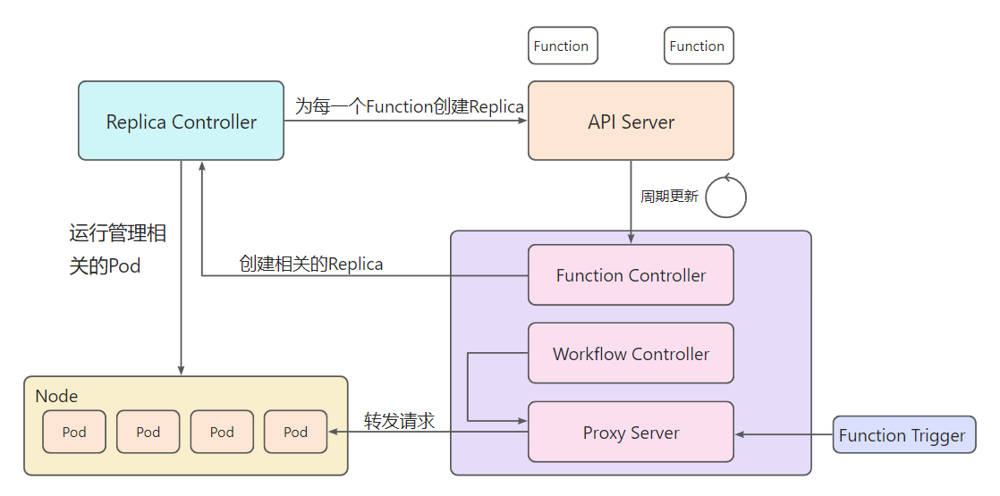

Serveless功能点主要实现了两个抽象：Function和Workflow抽象，Function对应的是用户自己定义的python函数，而Workflow对应的是讲若干个Funcion组合起来，组成的一个工作流。工作流支持判断节点对于输出的结果进行判断，也支持路径的二分叉。

## Function抽象

实现Function抽象我们主要是通过编写了一个自己的[Function-Base镜像](https://hub.docker.com/repository/docker/musicminion/func-base)，该镜像同样支持Arm和X86_64。Function-Base镜像里面是一个简单的Python的Flask的服务器，会实现参数的解析，并传递给用户的自定义的函数。当我们创建一个Function的时候，我们首先需要拉取Function-Base镜像，然后将用户自定义的文件拷贝到镜像里面，再将镜像推送到minik8s内部的镜像中心(该镜像中心是通过docker启动了一个容器实现)，当用户的函数需要创建实例的时候，本质是创建了一个ReplicaSet，用来创建一组Pod，这些Pod的都采用的上述推送到minik8s内部的镜像中心的镜像。

为了方便对于用户云函数请求的统一管理，我们在Serveless的程序里面添加了一个Server(或者理解为Proxy)，当用户要通过统一的接口触发函数的时候，Serveless-Server会在自己的RouteTable里面查找相关函数对应的Pod的IP，然后将请求转发给相关的Pod，处理完成之后返回给用户。如果发现相关的Function对应的Replica数量为0，那么他还会触发Replica Resize的操作，把相关Replica的数量设置为大于0的数量。

显然，如果用户长期没有请求云函数，这个函数对应的Replica一段时间就会数量设置为0。当用户再次请求的时候，由于整个Replica的状态维护是有一个响应链的，数量的修改需要一段时间才能生效，所以不太可能让用户一请求就立马实现冷启动，然后立刻返回处理结果。如果没有实例。只会返回告知用户稍后再来请求，函数实例可能正在创建中。

## Workflow抽象

对于Workflow，我们采用类似的WorkflowController，定期检查API-Server里面的Workflow，如果发现有任务栏没有被执行(也就是对应的Status里面的Result是空)，Workflow Controller就会尝试执行这个工作流。

我们的工作流里面有两类节点，一个对应的是funcNode，也就是说这个节点对应的一个function，这时候Workflow Controller就会将上一步的执行结果(如果是第一个节点那就是工作流的入口参数)发送给对应namespace/name下的function来执行。另外一个类型节点对应的是optionNode，这个节点只会单纯对于上一步的执行结果进行判断。如果判断的结果是真，就会进入到TrueNextNodeName，如果判断的结果是假，就会进入到FalseNextNodeName。

以下为整个serverless的实现框架：



- function.yaml

  ```
  apiVersion: v1
  kind: Function
  metadata:
    name: func1
  spec:
    userUploadFilePath: "/xx/example-1" # 计算任务所在目录
  ```

- workflow.yaml

  ```
  kind: Workflow
  apiVersion: v1
  metadata:
    name: workflow-example
    namespace: default
  spec:
    entryParams: '{"x": 1, "y": 2}'
    entryNodeName: node1
    workflowNodes: 
    - name: node1
      type: func			# 节点类型，func为计算节点，choice为判断节点
      funcData:
        funcName: func2   # x = x + y, y = x - y
        funcNamespace: default
        nextNodeName: node2
    - name: node2
      type: choice
      choiceData:
        trueNextNodeName: node3
        falseNextNodeName: node4
        checkType: numGreaterThan   # if checkVar > 0, goto node3, else goto node4
        checkVarName: y
        compareValue: 0
    - name: node3
      type: func
      funcData:
        funcName: func3    # x = x^2, y = y^2
        funcNamespace: default
    - name: node4
      type: func
      funcData:
        funcName: func1    # x = x - y, y = y - x
        funcNamespace: default
  ```

使用方法：

- 创建function

  `kubectl apply function.yaml`

- 触发对应function

  `kubectl execute [namespace]/[funcname] {args}`

- 创建对应workflow

  `kubectl apply workflow.yaml`

- 查看执行结果

  `kubectl get workflow [namespace]/[workflowname]`