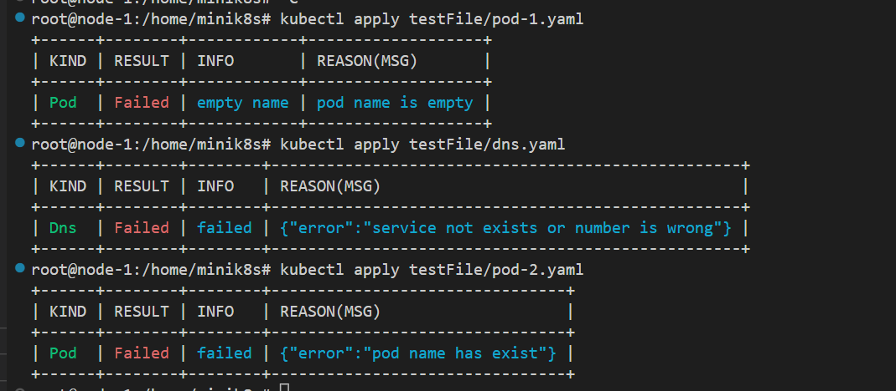

我们的容错性体现在以下两个方面

## 容错

### 应对控制面崩溃

有关pod的信息全部持久化在etcd存储中，有关service的路由配置则持久化在各节点的iptables中，dns的相关配置同样保存在各个节点的相应文件内。
当整个控制面(包括Apiserver，controller，scheduler)以及各个节点上的组件(包括Kubelet，Kubeproxy)发生崩溃时并不会导致相关数据的丢失，当以上应用重启后，pod与service仍然可以正常访问。

### 应对主从不一致

如果由于某些原因导致控制平面与worker节点上的pod状态不一致时，我们以控制平面的状态为准，具体做法如下：
- Kubelet的StatusManager定期从控制平面拉取最新的pod的状态并持久化在Redis中
- Kubelet的RuntimeManager定期从实际运行的容器中获取容器状态
- PlegManager定期比较RuntimeManger与StatusManager获取的pod状态，根据比较结果产生相应事件
  - 删除多余的pod
  - 创建缺少的pod
  - 重启丢失的container

## 系统健壮性

我们的系统鲁棒性主要体现在可以处理错误输入与错误的文件格式，并设计了十分完善的错误提示，可以处理大小写错误，参数错误，参数丢失等问题，如图所示：

另外对于一些错误的提交也能正确地识别，包括文件格式错误，关键信息缺失或是重复创建等问题，如图所示：

