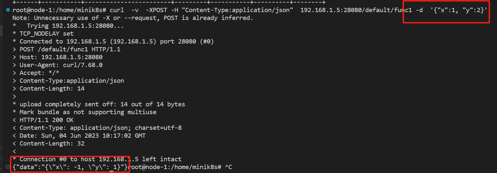

## 答辩问题的解释

:::info
关于答辩过程中的问题，我们专门安排一个版面进行详细的解释。
:::

### 问题一

> 关于助教对于我们触发Function的方式有疑问，我们的解释如下：

我们是通过kubectl实现的，kubectl的内部本质是通过发送http请求，触发函数，然后获得结果的。 要理解这个问题就需要详细的讲一讲我们的Serveless的设计的架构。

如下图所示，我们的Serveless主要是通过Serveless这个程序(运行在控制平面的一个进程)实现的，这个程序有下面的两个功能：

- 定期的拉取API-Server的Function的情况，和Function对应的ReplicaSet进行比较，并且记录每一段时间触发函数的数量，如果数量过少为0，那么就会Scale to zero
- 讲Http请求转发给相关的Pod。为了实现触发函数，Kubectl内置了`Execute`命令，这个命令会向Serveless这个程序发送http请求，请求的URL是：`/:funcNamespace/:funcName`


- 如下所示，Kubectl发送请求会指定好对应的Function的Namespace和Name，然后Serverless这个程序内置了一个Server(或者说他的本质是一个Proxy，把来自Kubectl的请求，根据要调用的Function的Namespace和Name，转发给相关函数的Pod)。
- Serverless这个程序内置了一个Server会维护一个RouteTable，记录和一个Function相关的所有的Pod的IP，然后把请求转发给Pod的IP，收到结果之后，然后把函数的处理结果返回给Kubectl。这样用户就可以查看到函数调用的结果
- 如下面的代码所示，是Serverless程序内置的一个服务器，启动的时候暴露相关的接口，供Kubectl调用。

```go
func (s *server) Run() {
	// 周期性的更新routeTable
	go executor.Period(RouterUpdate_Delay, RouterUpdate_WaitTime, s.updateRouteTableFromAPIServer, RouterUpdate_ifLoop)

	// 周期性的检查function的情况，如果有新创建的function，那么就创建一个新的pod
	go s.funcController.Run()

	// 周期性的检查workflow的情况，如果有新创建的workflow，那么就创建一个新的pod
	go s.workflowController.Run()

	// 初始化服务器
	s.httpServer.POST("/:funcNamespace/:funcName", s.handleFuncRequest)
	s.httpServer.GET("/:funcNamespace/:funcName", s.checkFunction)
	s.httpServer.Run(":" + strconv.Itoa(config.Serveless_Server_Port))
}
```

- 在kubectl里面，发送请求的代码如下：

```go
func executeHandler(cmd *cobra.Command, args []string) {
    // 检查用户的传递的参数
	if len(args) <= 1 {
		fmt.Println("missing some parameters")
		fmt.Println("Use like: kubectl execute" + " [namespace]/[name] [parameters]")
		return
	}

	namespace, name, err := parseNameAndNamespace(args[0])
	if err != nil {
		fmt.Println(err)
		return
	}
	if namespace == "" || name == "" {
		fmt.Println("name of namespace or podName is empty")
		fmt.Println("Use like: kubectl execute" + " [namespace]/[name] [parameters]")
		return
	}
	// 解析参数
	jsonString := args[1]
	var jsonData map[string]interface{}
	err = json.Unmarshal([]byte(jsonString), &jsonData)
	if err != nil {
		fmt.Println("解析JSON出错:", err)
		return
	}

	// 向serveless server发送POST请求
    // 组装一个URL，然后发送Post请求，调用函数为netrequest.PostRequestByTarget
	URL := config.GetServelessServerURLPrefix() + "/" + namespace + "/" + name
	code, res, err := netrequest.PostRequestByTarget(URL, jsonData)
	if err != nil {
		fmt.Println(err)
		return
	}
    
    // 根据返回的结果，展示给用户调用的信息
	if code != 200 {
		fmt.Println("execute function failed, code:", code, "msg: ", res.(map[string]interface{})["msg"])
		return
	}
	fmt.Println("execute function success, result:", res)
}
```

### 问题二

> 关于助教对于我们能否通过`curl`命令来触发函数，我们截图如下：

- 如下图所示，是通过curl发送POST请求给Serveless内置的Server，发送的请求体里面包含了json格式的调用参数，返回的结果是执行之后的处理结果。该Function的功能是计算 $x=x-y, y=y-x$，计算结果和返回的一致
- 具体的信息请参考下面的截图




### 问题三

> 关于助教对于我们Scale-to-0之后的，再次冷启动的时候，第一次返回的信息是立刻返回的，而不是等到相关Pod启动之后返回，我们的解释如下：

- Scale-to-0之后，再次恢复原来的Scale这个过程需要一定的时间，可能大概在10s左右或者稍微更长的时间。我们认为如果这个时候直接等待，可能会超过http请求的时间限制，导致用户体验不好，所以我们的设计是返回一个给用户的提示，让用户稍后再主动做请求，而不是完全等待相关的Pod启动之后，再发送请求把结果返回给用户。

### 问题四

> Function对应的Pod是怎么实现的？怎么实现的Scale-to-zero？

- 我们的设计是每一个Function对应一个Replicaset，然后一个Replicaset管理一组相关的Pod。
- 当用户发送调用函数的请求的时候，我们基于Pod的IP，通过控制平面单独运行的Serveless程序内置的Proxy，把请求转发给相关的Pod。由于和Function相关的Pod的数量可能动态更新，所以Proxy内部维护了一张RouteTable，定期从API-Server更新最新的Pod的IP
- Scale-to-zero是通过统计每一个时间段内用户调用函数的请求的数量来实现的，如果一段时间没有调用函数，会把Replicaset的Pod的数量设置为0，这样就可以Scale-to-Zero。同样的道理，当有请求的时候，我们将Replicaset的Pod的数量设置为大于0的数值，就可以实现冷启动

### 问题五

> hpa部分是否实现自定义扩缩容时间？

- 我们首先设定了一个默认得到扩缩容间隔时间(15s，可调节), hpaController每隔这样一段时间就会进行hpa的更新，这个过程中可能会进行扩缩容
- 用户可以在hpa的yaml文件中指定扩缩容间隔时间，实际执行时，如果发现用户的指定时间大于默认时间，则会将该hpa对应的goroutine协程睡眠这个时间差的时间