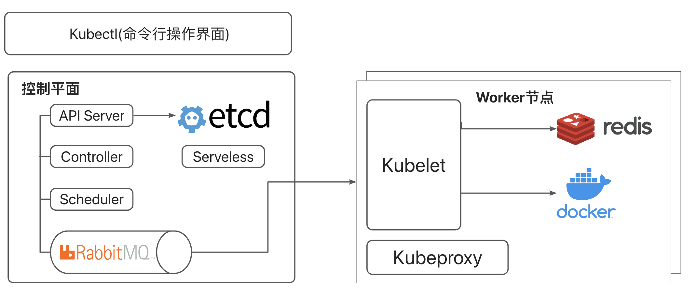

## 项目管理

:::info
这个部分介绍了项目采用的技术栈及开源库，同时展示了我们的工作流与项目管理方法
:::

### 使用到的开源库

- [github.com/docker/docker](https://github.com/moby/moby) 底层容器运行时的操作
- [github.com/pallets/flask](https://github.com/pallets/flask) Serveless容器内的运行的程序
- [github.com/gin-gonic/gin](https://github.com/gin-gonic/gin) APIServer框架
- [github.com/fatih/color](https://github.com/fatih/color) minik8s的分级日志系统
- [github.com/klauspost/pgzip](https://github.com/klauspost/pgzip) 用户文件的zip压缩
- [github.com/melbahja/goph](https://github.com/melbahja/goph) GPU Job的SSH的客户端
- [github.com/mholt/archiver](https://github.com/mholt/archiver) Docker镜像打包时用到的tar压缩
- [go.etcd.io/etcd/client/v3](https://github.com/etcd-io/etcd) 和Etcd存储交互操作的客户端
- [gopkg.in/yaml.v3](https://gopkg.in/yaml.v3) go的yaml文件解析
- [gotest.tools/v3](https://github.com/gotestyourself/gotest.tools) 项目测试框架
- [docker/login-action](https://github.com/docker/login-action) CICD自动推送镜像到dockerHub
- [docker/setup-qemu-action ](https://github.com/docker/setup-qemu-action)CICD交叉编译平台
- [github.com/google/uuid](https://github.com/google/uuid) API对象UUID的生成
- [github.com/spf13/cobra](https://github.com/spf13/cobra) Kubectl的命令行工具
- [github.com/jedib0t/go-pretty/table](https://github.com/jedib0t/go-pretty/table) Kubectl美化输出
- [github.com/coreos/go-iptables/iptables](https://github.com/coreos/go-iptables/) 封装了对iptables的修改操作

### 架构

**开发语言**：Golang。我们项目主要采用go语言(版本1.20)进行开发。之所以选择go语言，因为docker、k8s也是基于go开发的，并且docker提供了go相关的sdk，让我们轻松就能将项目接入，实现通过go语言来操作底层的容器运行、获取运行状态等信息。另外go语言本身具有很好的容错能力，通过强制检查返回值err的方式，也让错误报错更加友好。

**项目架构**：我们的项目架构学习了K8s的架构，同时又适应需求做了一定的微调。整体主要是由控制平面和Worker节点两类组成。运行在控制平面的组件主要有下面的几个：

- API Server：提供一系列Restful的接口，例如对于API对象的增删改查接口，供其他组件使用
- Controller：包括DNS Controller、HPA Controller、Replica Controller、JobController，主要是对于一些抽象级别的API对象的管理，状态的维护。
- Scheduler：负责从所有的可以使用的节点中，根据一定的调度策略，当收到Pod调度请求时，返回合适的节点
- Serveless：单独运行的一个服务器，负责维护Serveless的函数相关对象的管理，同时负责转发用户的请求到合适的Pod来处理
- RabbitMQ：作为消息队列，集群内部的进程间通讯工具
运行在WorkerNode上面的主要有下面的几个组件
- kubeproxy：负责DNS、Iptable的修改，维护Service的状态等
- Kubelet：维护Pod的底层创建，Pod生命周期的管理，Pod异常的重启/重建等
Redis：作为本地的缓存Cache，哪怕API-Server完全崩溃，因为有本地的Redis，机器重新启动之后，Kubelet也能够恢复之前容器的状态

### 项目管理

#### 项目分支

我们的开发采用多分支进行。每一个功能点对应一个Feature分支(对于比较复杂的功能分支可能会有不同组员自己的Branch)，所有的推送都会经过`go test`的测试检验。并可以在[这里](https://github.com/Musicminion/minik8s/actions)查看详细的情况。

项目一共包含主要分支包括

- Master分支：项目的发行分支，**只有通过了测试**,才能通过PR合并到Master分支。
- Development分支：开发分支，用于合并多个Feature的中间分支，
- Feature/* 分支：功能特定分支，包含相关功能的开发分支

如下图所示，是我们开发时候的Pr合并的情况。所有的Pr都带有相关的Label，便于合并的时候审查。考虑到后期的合并比较频繁，我们几乎都是每天都需要合并最新的工作代码到Development分支，然后运行单元测试。测试通过之后再合并到Master分支。

**CI/CD介绍**：CI/CD作为我们软件质量的重要保证之一。我们通过Git Action添加了自己的Runner，并编写了项目的测试脚本来实现CI/CD。保证每次运行前环境全部初始化。

- 所有的日常代码的推送都会被发送到我们自己的服务器，运行单元测试，并直接显示在单次推送的结果后方
- 当发起Pr时，自动会再一次运行单元测试，测试通过之后才可以合并
- 运行单元测试通过之后，构建可执行文件，发布到机器的bin目录下
- 以上2,3条通过之后，对于合并到Master的情况，会构建docker相关的镜像(例如GPU Job的docker镜像、Function的基础镜像)推送到dockerhub

**软件测试介绍**：go语言自身支持测试框架。并且鼓励把项目文件和测试文件放在同一个文件夹下面。例如某一个项目的文件是file.go,那么测试的文件的名字就是file_test.go。最终要运行整个项目测试的时候，只需要在项目的根目录运行 `go test ./...` 即可完成整个项目的测试。测试会输出详细的测试通过率，非常方便。

**功能开发流程**：

- 我们的软件开发基于迭代开发、敏捷开发。小组成员每天晚上在软件学院大楼实验室集中进行开发新功能，减少沟通障碍，做到有问题及时解决、沟通，有困难相互请教，这也大大的提高了我们小组的效率。截止15周周末，我们已经完成了所有的功能的开发。基本符合预期进度。
- 对于新功能开发，我们采用"动态分配"方法，根据进度灵活分配成员的任务。项目框架搭建好之后，基本上在任何时间点小组同时在开发两个或者两个以上的需求。一人开发完成之后，交给另外一个组员完成代码的审查和测试，测试通过之后合并到Master
- 功能开发的过程主要是：简要的需求分析->设计API对象->设计API-Server的接口->设计Etcd存储情况->编写该需求的运行逻辑代码->编写Kubectl相关代码->最终测试
- 具体如下图所示，在整个开发的流程中，我们基本都是在重复下面的流程图。

- 当然我们在开发的过程中也在及时更新文档，如下图所示，是我们的API-Server的详细接口文档，便于组员之间了解对方的开发情况

**开发简介**：

- 项目代码体量大约2w行代码，开发周期大约1.5月
- 完成要求里面的全部功能
