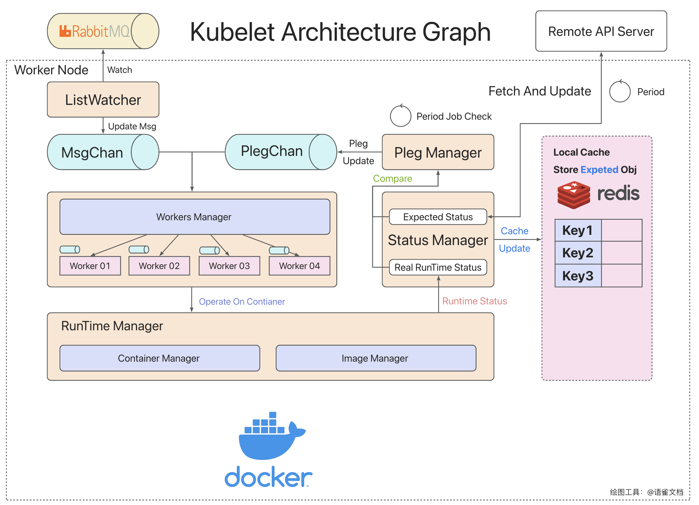
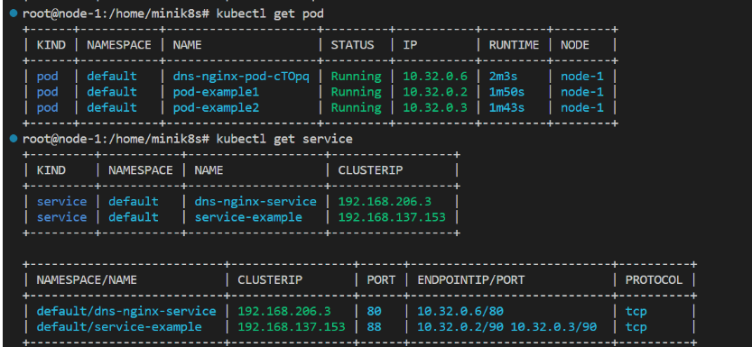
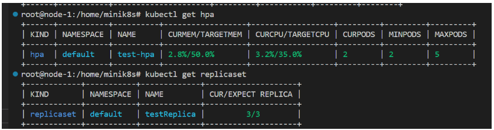

## 项目组件的详情

### API Server

**API-Server**：API Server是minik8s控制平面的核心。主要负责和etcd存储交互，并提供一些核心的APIObject的API，供其他组件使用。在设计API Server的API时候，我们主要考虑了两个特性，一个是状态(Status)和期望(Spec)分离的情况，另外一个是Etcd的路径和API分离。

如果没有分离，我们考虑下面的情景：当一个Kubelet想要更新某一个Pod的状态的时候，试图通过Post或者Put请求写入一个完整的Pod对象，在此之前,假如用户刚刚通过`kubectl apply`更新了一个Pod的信息，如果按照上面我所叙述的时间线，就会出现用户的apply的更新的Pod被覆盖了。同样的道理，如果用户删除了一个Pod，按照上面的设计，Kubelet在回传的时候写入了一个完整的Pod，相当于没有做任何的删除。

虽然说上面的例子是因为期望和状态没有分离，但是本质是Kubelet的权限太大，能够写入一个完整的Pod。所以为了解决这种问题，我们对于一个对象，往往设计了更新对象接口(更新整个对象)，更新对象的状态接口(仅仅更新Status，如果找不到对象那么就不更新)

第二个设计时分开了API的格式和Etcd存储API对象的路径。Etcd存储API对象的路径都是诸如`registry/pods/<namespace>/<name>`，而API的格式大多都是`/api/v1/pods/namespaces/:namespace/name/:name`,可以看到两者的差别还是比较明显的，这是因为API版本看发生动态变化(在实际的k8s中也是这样)，但是存储的路径保证兼容原来的。所以在我们的minik8s中，我们同样借鉴了这样的思路。

更多有关API-Server的内容以及详细的API文档，请移步到`/pkg/apiserver`下的Readme查看。

### Kubelet架构

**Kubelet**：Kubelet是和容器底层运行交互的组件，确保每一个Pod能够在该节点正常运行。目前Kubelet架构设计如下(我们参考了k8s的反馈路径设计并做了一定的微调，以适应项目)

- Kubelet主要由：StatusManager、RunTimeManager、PlegManager、WorkerManager几个核心组件和Pleg、MsgChan的通道组成。
- RunTimeManager和底层的Docker交互，用于创建容器、获取容器运行的状态、管理镜像等操作
- WorkerManager用于管理Worker，我们的策略是每一个Pod分配一个Worker，然后由WorkerManager进行统一的调度和分配。每一个Worker有他自己的通道，当收到Pod的创建或者删除任务的时候，就会执行相关的操作
- PlegManager用来产生Pleg(Pod LifeCycle Event)，发送到PlegChan。PlegManager会调用StatusManager，比较缓存里面的Pod的情况和底层运行的Pod的情况，产生相关的事件。
- ListWatcher会监听属于每个Node的消息队列，当收到创建/删除Pod的请求的时候，也会发送给相关的WorkerManager
- 也就是说创建Pod会有消息队列/StatusManager检测到和远端不一致这样两种路径，前者的效率更高，后者用于维护长期的稳定。两者协同保证Pod的正确运行

具体来说，各个组件之间的行为和关系如下图详细所示。

- Runtime Manager会负责收集底层正在运行的所有的容器的信息，并把容器的信息组装为Pod的状态信息。同时收集当前机器的CPU/内存状态，把相关的信息回传到API Server，及时更新。
- Status Manager还会定期的从API Server拉取当前节点上所有的Pod，以便于比较和对齐，产生相关的容器生命周期事件(Pleg)，
- Status Manager对于所有更新获取到的Pod，都会写入Redis的本地缓存，以便于API-Server完全崩溃和Kubelet完全崩溃重启的时候，Kubelet有Pod的期望信息，能够作为对齐目标
- 当出现Pod不一致的时候，以远端的API-Server的数据为主，并清除掉不必要的Pod。如下图所示，会清空不必要的Pod，并创建本地没有的Pod，实现和远端数据的对齐。

### Controller架构

minik8s需要controller对一些抽象的对象实施管理。Controller是运行在控制平面的一个组件，具体包括DNS Controller、HPA Controller、Job Controller、Replica Controller。之所以需要Controller来对于这些API对象进行管理，是因为这些对象都是比较高度抽象的对象，需要维护已有的基础对象和他们之间的关系，或者需要对整个系统运行状态分析之后再才能做出决策。具体的逻辑如下：

- Replica Controller：维护Replica的数量和期望的数量一直，如果出现数量不一致，当通过标签匹配到的Pod数量较多的时候，会随机的杀掉若干Pod，直到数量和期望一致；当通过标签匹配到的Pod数量偏少的时候，会根据template创建相关的Pod
- Job Controller：维护GPU Job的运行，当一个新的任务出现的时候，会被GPU JobController捕捉到（因为这个任务没有被执行，状态是空的），然后Controller会创建一个新的Pod，让该Pod执行相关的GPU任务。
- HPA Controller：分析HPA对应的Pod的CPU/Mem的比例，并计算出期望的副本数，如果当前副本和期望数量不一致，就会触发扩容或者缩容。所有的扩容、缩容都是以一个Pod为单位进行的，并且默认的扩容/缩容的速度是15s/Pod。如果用户自己指定了扩缩容的速度，那么遵循用户的规则。
- DNS Controller：负责nginx service的创建，同时监听Dns对象的变化，当有Dns变化时会向所有的node发送hostUpdate以更新nginx的配置文件和hosts文件

### Kubectl

Kubectl是minik8s的命令行交互工具，命令的设计基本参考kubernates。我们使用了Cobra的命令行解析工具，大大提高了命令解析的效率。

支持的命令如下所示：

- `Kubectl apply ./path/to/your.yaml` 创建一个API对象，会自动识别文件中对象的Kind，发送给对应的接口
- `Kubectl delete ./path/to/your.yaml` 根据文件删除一个API对象，会自动识别文件中对象的name和namespace，发送给对应的接口(删除不会校验其他字段是否完全一致)
- `kubectl get [APIObject] [Namespace/Name]` 获取一个API对象的状态(显示经过简化的信息，要查看详细的结果，请使用Describe命令)
- `kubectl update [APIObject] ./path/to/your.yaml`, 更新一个API对象，会自动识别文件中对象的name和namespace，发送给对应的接口
- `kubectl describe [APIObject] [Namespace]/[Name]` 获取一个API对象的详细的json信息(显示完整的经过优化的json字段)
- `kubectl execute [Namespace]/[FunctionName] [parameters]` 触发一个Serveless的函数，并传递相关的参数，返回执行结果

另外，我们对所有指令的输出都进行了美化，并根据API对象的不同对输出内容进行了调整，以下为示例输出：

### Scheduler

Scheduler是运行在控制平面负责调度Pod到具体Node的组件。Scheduler和API-Server通过RabbitMQ消息队列实现通讯。当有Pod创建的请求的时候，API-Server会给Scheduler发送调度请求，Scheduler会主动拉取所有Node，根据最新的Node Status和调度策略来安排调度。

目前我们的Scheduler支持多种调度策略：

- RoundRobin：轮询调度策略
- Random：随机调度策略
- LeastPod：选择Pod数量最少的节点
- LeastCpu：选择CPU使用率最低的作为调度目标
- LeastMem：选择Mem使用率最低的作为调度的目标

这些调度策略可以通过启动时候的参数进行指定。

### Kubeproxy

Kubeproxy运行在每个Worker节点上，主要是为了支持Service抽象，以实现根据Service ClusterIP访问Pod服务的功能，同时提供了一定负载均衡功能，例如可以通过随机或者轮询的策略进行流量的转发。同时Kubeproxy还通过nginx实现了DNS和转发的功能。

目前Kuberproxy设计如下：

- Kuberproxy主要由IptableManager、DnsManager两个核心组件和serviceUpdateChan、DnsUpdateChan的通道组成。
- 当Kubeproxy启动后会向API-Server发送创建nginx pod的请求，并在之后通过nginx pod来进行反向代理
- IptableManager用于处理serviceUpdate, 根据service的具体内容对本机上的iptables进行更新，以实现ClusterIP到Pod的路由。
- DnsManager用于处理hostUpdate，这是来自DnsController的消息，目的是通知节点进行nginx配置文件和hosts文件的更新，以实现DNS和转发功能，不过由于实现上的考虑不足，DnsManager的这部分功能由Kubeproxy直接承担了。
