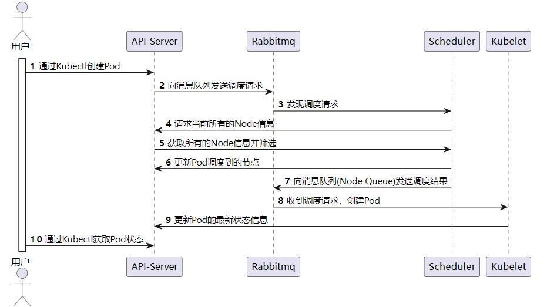
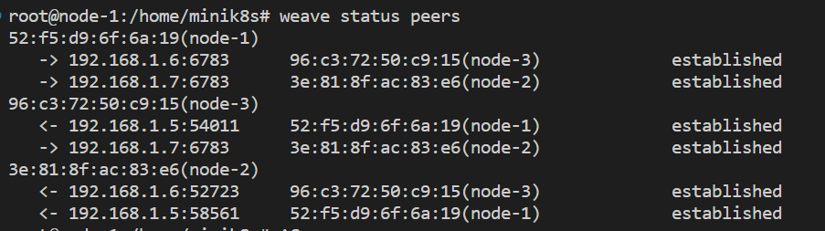

## Pod抽象

Pod是k8s(minik8s)调度的最小单位。用户可以通过 `Kubectl apply Podfile.yaml` 的声明式的方法创建一个Pod。当用户执行该命令后，Kubectl会将创建Pod的请求发送给API-Server。API-Server检查新创建的Pod在格式、字段是否存在问题，如果没有异常，就会写入Etcd，并给Scheduler发送消息。

Scheduler完成调度之后，会通过消息队列通知API-Server，API-Server收到调度结果，将对应的Pod的nodename字段写入调度结果，然后保存回Etcd。然后主动给相关的Kubelet发送Pod的创建请求。

之前已经介绍到Kubelet创建Pod可以有两条途径，一条是长期拉取自己节点所有的Pod，另外一条途径是收到消息队列的创建请求之后主动创建。我们经过多次测试保证这两条途径**不会冲突**，因为在WorkManager底层是每一个Pod对应一个Worker，一旦收到了创建请求，再次收到创建请求的时候就会被忽略。Kubelet收到创建Pod请求之后，会把Pod的配置信息写入到本地的Redis里面，这样即使是API-Server崩溃，Kubelet出现重启，也能够保证Pod的信息可以读取到。

Pod创建之后，Kubelet的Status Manager会不断监视Pod的运行状态，并将状态更新写回到API-Server(通过Pod的Status的接口)。如果Pod中的容器发⽣崩溃或⾃⾏终⽌，首先PlegManager会通过StatusManager捕捉到Pod的异常状态，然后会产生Pod生命周期时间，通过PlegChan发送需要重启Pod的命令。然后WorkerManager收到之后会执行重启的操作。

pod内需要能运⾏多个容器，它们可以通过localhost互相访问。这一点我们是通过Pause容器实现的。将Pod相关的容器都加入pause容器的网络名字空间，这样就能实现同一个Pod里面的容器的通讯。至于PodIP的分配，我们使用了Weave网络插件，保证多机之间PodIP唯一的分配。

特别感谢[这篇文章](https://k8s.iswbm.com/c02/p02_learn-kubernetes-pod-via-pause-container.html)的精彩讲解，让我们了解了实现Pod内部容器的通讯。

具体创建Pod的时序图如下所示

## CNI Plugin

Minik8s⽀持Pod间通信，我们组选择了Weave网络插件，只需要通过简单的`weave launch`和`weave connect`等命令，就可以将一个节点加入到Weave网络集群里面。Weave插件会将容器与特定的IP绑定关联（`weave attach`命令绑定容器到Weave网络），实现多个Pod之间的通讯。同时Weave具有比较智能的回收功能，一旦某个容器被删除，相关的IP也会被回收，供下次再分配。

下图是通过weave将三台主机加入同一个虚拟网络的示意图：

