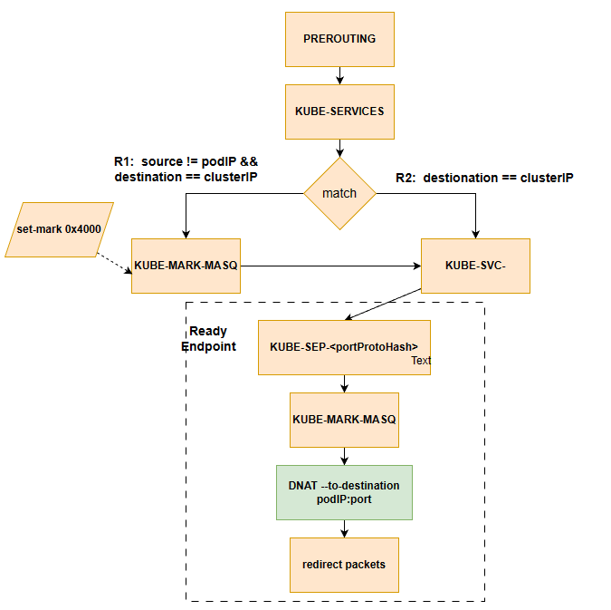

- 在Kubernetes中，应用在集群中作为一个或多个Pod运行, Service则是一种暴露网络应用的方法。在我们的设计里，Service被设计为一个apiObject, 用户可以通过 `Kubectl apply Servicefile.yaml `的声明式的方法创建一个Service。

- 在Kubernetes中，部分pod会有属于自己的Label，这些pod创建时，API-Server会基于标签为它们创建对应的endpoint。当我们创建sevice时，会根据service的selector筛选出符合条件的endpoint，并将service和这些endpoint打包在一起作为serviceUpdate消息发送到所有Node的kubeproxy。

- 我们选择使用Iptables来实现proxy功能。当Kubeproxy收到service的更新消息后，会依据service和endpoint的ip信息更新本地的iptables，具体的更新方法参照了[这篇文章](https://www.bookstack.cn/read/source-code-reading-notes/kubernetes-kube_proxy_iptables.md), 出于简化的目的我们删去了一些规则，最终Iptables的设计如下：

此时访问service的规则流向为：
`PREROUTING --> KUBE-SERVICE --> KUBE-SVC-XXX --> KUBE-SEP-XXX`

Service和Pod的创建没有先后要求。如果先创建Pod，后创建的Service会搜索所有匹配的endpoint。如果先创建Service，后创建的pod创建对应的endpoint后会反向搜索所有匹配的Service。最终将上述对象打包成serviceUpdate对象发送给kubeproxy进行iptables的更新。
