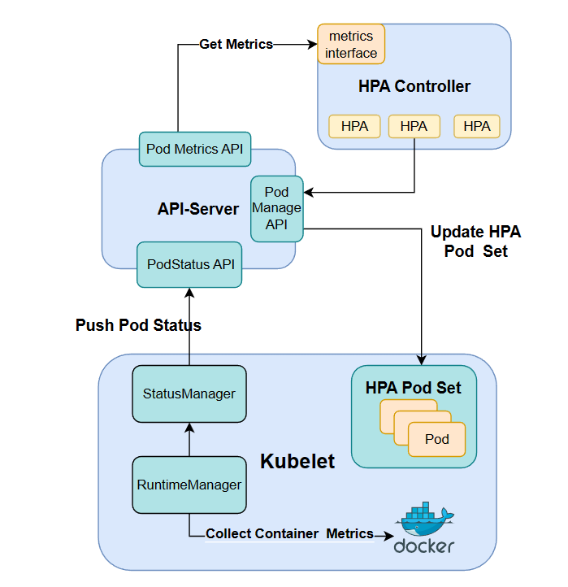

## ReplicaSet抽象
ReplicaSet可以用来创建多个Pod的副本。我们的实现是通过ReplicaSet Controller。通常来说创建的ReplicaSet都会带有自己的ReplicaSetSelector，用来选择Pod。ReplicaSet Controller会定期的从API-Server抓取全局的Pod和Replica数据，然后针对每一个Replica，检查符合状态的Pod的数量。如果数量发现小于预期值，就会根据Replica中的Template创建若干个新的Pod，如果发现数量大于预期值，就会将找到符合标签的Pod删去若干个(以达到预期的要求)

至于容错，我们放在了底层的Kubelet来实现。Pleg会定期检查运行在该节点的所有的Pod的状态，如果发现Pod异常，会自动重启Pod，保证Pod的正常运转。

以下为示例yaml文件：

```yaml
apiVersion: v1
kind: Replicaset
metadata:
  name: testReplica
spec:
  replicas: 3
  selector:
    matchLabels:
      labelkey1: labelvalue1
  template:
    metadata:
      name: replicaPod
      labels:
        labelkey1: labelvalue1
    spec:
      containers:
      - name: testContainer-1
        image: docker.io/library/nginx
        ImagePullPolicy: IfNotPresent

```

使用方法:

`kubectl apply replicaset.yaml`

## 动态伸缩与HPA抽象

为了实现对Pod的动态伸缩控制，我们实现了HPA（Horizontal Pod  Autoscaler）对象,  它选择Pod作为Workload，通过Selector筛选出对应Pod后，监测这些Pod的资源指标（在我们的实现中是CPU和Memory）并进行动态伸缩。

我们使用HPAController进行HPA对象与相应Pod的管理，HPAController会定期的从API-Server抓取全局的Pod和HPA数据，然后针对每一个HPA对象，检查它匹配的Pod的资源指标，并基于以下公式（参考自[Horizontal Pod Autoscaling](https://kubernetes.io/docs/tasks/run-application/horizontal-pod-autoscale/)）计算出Pod的期望数量然后将Pod的实例数向期望数量调整。
$$
desiredReplicas = ceil[currentReplicas * ( currentMetricValue / desiredMetricValue )]
$$
简单来说，当Pod的平均资源使用量超标时则会扩容以降低平均平均负载，反之则会缩容。另外为了避免副本数变化过快，我们还进行了相应的速度限制。

数据采集方面，我们直接通过docker client提供的接口抓取container的实时指标(等效于docker stats)，并通过StatusManager定期的回传任务将指标写入到etcd的podStatus中，以下为实现动态伸缩的架构图：



HPA相关Pod的容错同样交给了Kubelet来维持，因此HPAController只需要负责监测与调整即可。

以下为示例yaml文件：

```yaml
apiVersion: v1
kind: Hpa
metadata:
  name: test-hpa
spec:
  minReplicas: 2
  maxReplicas: 5
  workload:       
    kind: Pod             # hpa作用的的对象：Pod
    metadata:
      name: test-pod
      namespace: test-namespace
  adjustInterval: 15s     # 扩缩容的速度限制
  selector:
    matchLabels: 
      app: hpa
  metrics:
    cpuPercent: 0.35	  # 期望的平均cpu利用率
    memPercent: 0.5		  # 期望的内存利用率
```

使用方法：

创建hpa对应的pod之后，执行以下命令：

`kubectl apply hpa.yaml`