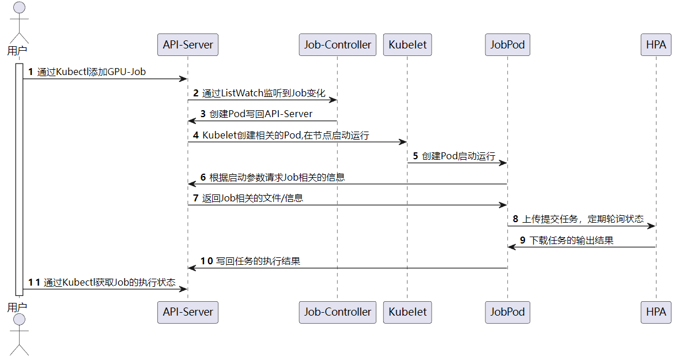
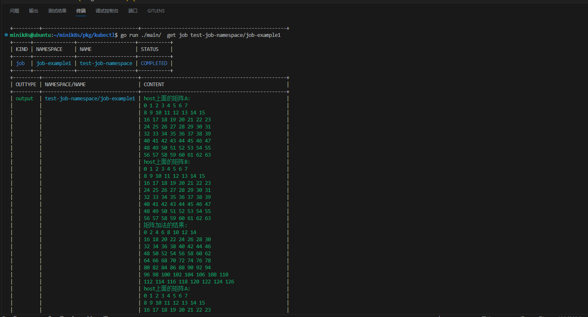

## GPU Job

GPU任务本质是通过Pod的隔离实现的。我们自己编写了[GPU-Job-Server](https://hub.docker.com/r/musicminion/minik8s-gpu)，并发布了arch64和arm64版本的镜像到Dockerhub。GPU-Job-Pod启动的时候，会被传递Job的namespace和name，该内置的服务器会主动找API-Server下载任务相关的文件和配置信息，根据用户指定的命令来生成脚本文件。

然后，GPU-Job-Server会使用用户提供的用户名、密码登录到交大的HPC平台，通过slurm脚本提交任务，然后进入等待轮寻的状态。当任务完成之后，会将任务的执行的结果从HPC超算平台下载，然后上传给API-Server，到此为止一个GPU的Job全部完成。

以下为GPU任务提交与执行的时序图：



我们编写了简易的并行矩阵加法和乘法函数。使用CUDA编程的情况下，我们首先定义了matrix_add和matrix_multiply两个使用__global__标记的核函数，矩阵加法和矩阵乘法使用的是正常的操作。为了显示出区别，A\[i]\[j]和B\[i]\[j]没有初始化成一样的数据，而是初始化成不同的数据，这样得到的C\[ i ][ j ]能够检验我们的工作是否是正确的。

CUDA的风格类C，所以在处理矩阵这样的二维数组时需要两重指针，在进行host内存和device内存之间的数据转移。

```  cuda
cudaMemcpy((void *)dev_A, (void *)host_A, sizeof(int *) * M, cudaMemcpyHostToDevice);

cudaMemcpy((void *)dev_B, (void *)host_B, sizeof(int *) * M, cudaMemcpyHostToDevice);

cudaMemcpy((void *)dev_C, (void *)host_C, sizeof(int *) * M, cudaMemcpyHostToDevice);
```

这里的cudaMemcpy函数作用是拷贝一段连续的内存，所以无法处理二重指针，需要辅助指针dev_A,dev_B和dev_C，也就是说我们共需要四类指针，host上的二重和一重指针，device上的二重和一重指针。

最终输出的效果如下所示：



示例yaml文件：

```yaml
apiVersion: v1
kind: Job
metadata:
  name: job-example1
  namespace: test-job-namespace
spec:
  partition: dgx2
  nTasks: 1
  nTasksPerNode: 6
  submitDirectory: "change-me"
  runCommands: [
    "module load cuda/9.2.88-gcc-4.8.5",
    "nvcc matrix_add.cu -o matrix_add",
    "nvcc matrix_multiply.cu -o matrix_multiply",
    "./matrix_add",
    "./matrix_multiply",
  ]
  outputFile: "job-example1.out"
  errorFile: "job-example1.err"
  username: "change-me"
  password: "change-me"
  gpuNums: 1
```

使用方法：

`kubectl apply job.yaml`